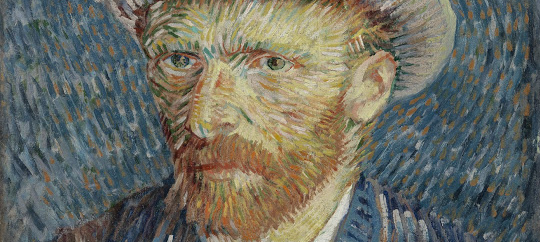

# VanScrape

<div style="text-align: center">
  </img>
  <hr>
  <br>
  <p>A simple web scraper to download all the complete works of Van Gogh, published by the Van Gogh museum.</p>
</div>


## Getting Started

Before running this, you should create a virtual environment and install the dependencies:

```bash
$ conda create env -n vanScrape python=3 -y
$ source activate vanScrape
(vanScrape) $ pip install -r requirements.txt
```


## Set your configuration

* Open the `job.json` file
* Set your desired configuration:

  - `size`: Choose from "large", "medium", "small"
  - `output_dir`: Output directory to store images
  - `num_download`: Number of images to download

## Run the file

```bash
(vanScrape) $ python main.py
```

**Note**
_I have been experiencing some slow speeds. Most probably their server is being bogged down by all the people from Hackernews doing what I'm doing..._